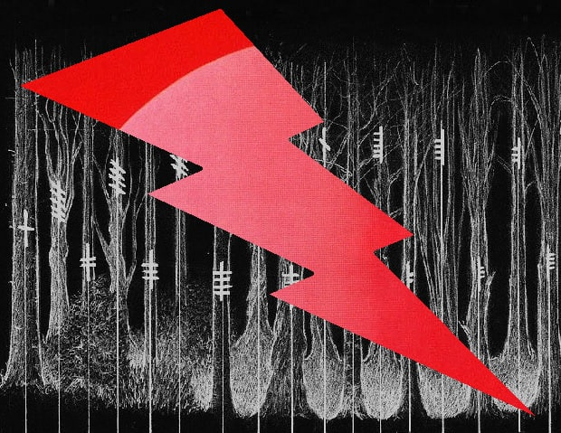

# ORAGANIZADOR DEL COMPUTADOR 2 - TP N°2

El archivo .sh se ejecuta en la línea de comandos con los siguientes comandos : 
- cd Descargas/ProyectosUNGS-dev/ORGA2/SEM202/TP2/code (la ruta donde se tiene alojada la carpeta "code")
- sh ./setup_v01.sh prueba destino ("prueba" es una carpeta donde se guardan las imagenes a enmascarar y "destino" el lugar donde se alojaran todos los archivos de salida)
- al ejecutar el .sh, por segunda vez en adelante, en la línea de comandos se pedira que se elimine la carpeta "destino" para poder volver a escribirla.

En los tiempos de respuesta para cada imagen, el mas lento en cuanto mas se agranda el tamaño de la imagen va a ser la funcion de c sin los hilos siendo la mas lenta, despues seguiria la funcion de c pero ejecutada por hilos y la mas rapida es el codigo asm aprovechando los registros mmx y el SIMD se puede conseguir un menor tiempo de respuesta a la hora de combinar las imagenes.

En el siguiente grafico se muestran los tiempos representado por una "t" en cada una de las funciones y con sus respectivos resoluciones:

Ejemplos de como quedan las imagenes:

